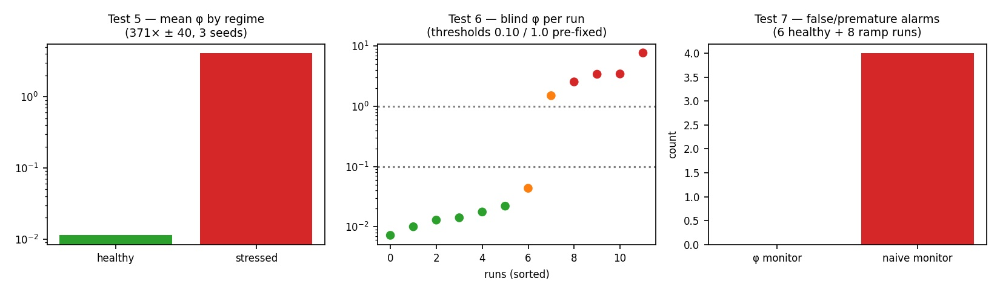
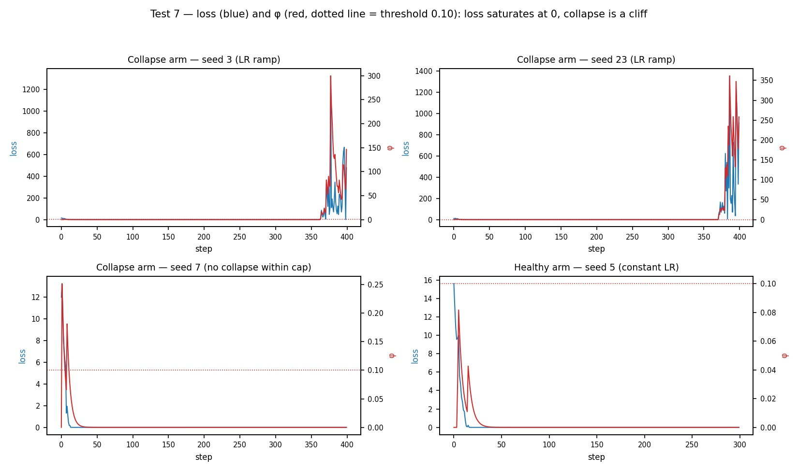

# The φ signal: a gradient-free training-stress monitor

*Preliminary technical validation note — Simona Vargiu, independent research · July 2026*

*(This is the GitHub-readable version of `phi_validation_note_EN.pdf`; content is identical.)*

## 1. Scope and surviving claim

This note documents the empirical validation to date of φ, a training
observability signal derived solely from the loss trajectory of a fine-tuning
run. φ is an exponential moving average (EMA, β = 0.8) of upward loss jumps,
optionally augmented by gradient norm when exposed. It requires no access to
gradients, weights, or model internals, and can therefore operate on top of
managed fine-tuning APIs (the validation below uses Qwen3-8B via the Tinker
API, where only per-step loss is exposed).

The surviving, supported claim is deliberately narrow and should be read as
**preliminary** — the evidence base is small (3–12 seeds per test, one model
family, one task type): **in the current validation setting, φ behaves as a
specific, near-instantaneous detector of training instability — not a
predictor.** The original hypothesis (an adaptive controller outperforming
AdaLoRA) and the predictive-lead-time hypothesis were both tested and are
reported in Section 4 as falsified or unresolved.

## 2. Protocol

All experiments are multi-seed, with decision thresholds fixed *before* data
collection and verdict criteria pre-registered in the scripts themselves
(including explicit failure conditions). The φ alarm threshold used
throughout is **φ = 0.10**, fixed from Test 5 data and reused unchanged in
Tests 6–7. Base model: Qwen3-8B; LoRA fine-tuning via Tinker; task: short
prompt→target completion pairs; per-step loss logged for every run. Raw
traces are provided as JSON files in this folder.

## 3. Supported results (preliminary)

### 3.1 Regime separation under natural stress (Test 5)

Paired arms on the same task and seeds: healthy LR (1e-4) vs aggressive LR
(3e-3), no induced corruption, 3 seeds. Mean φ: healthy 0.0113, stressed
4.14 — a separation of **371× ± 40** (per-seed ratios 340×, 428×, 345×),
zero NaN.

### 3.2 Blind classification with pre-fixed thresholds (Test 6)

12 runs with randomly assigned, hidden learning rates. Classification used
only mean φ and thresholds fixed in advance (healthy < 0.10 ≤ intermediate
< 1.0 ≤ stressed). Accuracy 10/12 (83%); the extremes were perfect — healthy
6/6, stressed 4/4. Both errors were 'intermediate' runs, which did not form
a distinct φ state: training behaved as effectively binary (stable or
unstable) and φ reflected this.

### 3.3 Specificity and baseline comparison (Test 7)

Six healthy runs of 300 steps each produced **zero false alarms** (φ never
crossed 0.10 for 3 consecutive steps). A naive baseline detector (loss >
1.5× baseline median, 3 consecutive steps) fired prematurely or spuriously
in 4 of 8 ramp runs (alarms at steps 60–78 for collapses occurring at steps
280–370). When collapse did occur, φ fired within 1–2 steps of it. Within
this validation setting, φ's operational profile is: silent on healthy runs,
near-instantaneous on collapse. The healthy-run sample is small (6 runs);
specificity should be confirmed on a larger and more varied set before being
treated as established.

## 4. Falsified and unresolved claims

### 4.1 Falsified: the adaptive controller (Unified-LoRA)

The original controller (dynamic rank + LR from φ) does not outperform
AdaLoRA on quality or stability. On a controlled toy comparison (3 seeds),
AdaLoRA achieved better final loss (0.198 vs 0.226) and was the only method
not diverging in the extreme regime (0/3 vs 3/3). On MRPC with 50% label
noise (3 seeds), AdaLoRA F1 0.518 vs fixed LoRA 0.374 vs Unified-LoRA 0.358.
The cause is structural: the controller regulates update magnitude but not
direction; AdaLoRA's SVD parametrization constrains direction, which is what
stabilizes hard regimes.

### 4.2 Unresolved: predictive lead time (Test 7)

Test 7 asked whether φ crosses its alarm threshold usefully *before* loss
collapse (pre-registered criterion: lead ≥ 10 steps in ≥ 6/8 runs, ≤ 1 false
alarm in 6 healthy runs, and beating the naive baseline). Design: 8 runs
with an exponential LR ramp (doubling period randomized per seed, so
collapse timing was not known in advance) plus 6 healthy runs; all detection
performed post-hoc on logged traces with causal rules (each alarm decision
uses only past data).

**Outcome: the predictive verdict is void due to a confound identified
during analysis.** The task (20 fixed pairs recycled for 400 steps) was
fully memorized within ~20 steps; the loss then sat at exactly zero for
hundreds of steps regardless of the growing LR, until an abrupt numerical
blow-up. A loss pinned at zero has no dynamics: no loss-derived signal could
have shown precursors on this task, so the observed lead times (−1 to −2
steps on all 4 clean runs) do not test the hypothesis. Two additional runs
never collapsed within the step cap and two had corrupted baselines
(median = 0), consistent with the same saturation. What the run *did*
provide is the specificity observation in §3.3, which is unaffected by the
confound.

A corrected protocol (Test 7 v3) replaces the recycled pairs with a
non-memorizable stream (novel pairs generated at every step), keeping the
loss informative throughout the run. This amendment is declared here before
execution.

*Figure: representative Test 7 traces. Loss (blue) saturates at zero after
~20 steps; collapse is an abrupt cliff; φ (red) fires at the cliff, 1–2
steps after the collapse criterion. Healthy arm: φ flat, no alarms.*

## 5. Positioning and open questions

Related work on training stability (ZClip, SPAM, gradient-norm alerting in
experiment trackers) operates on gradient norms and assumes trainer access.
φ's distinctive property is that it is **black-box**: computed from the loss
stream alone, it can monitor fine-tuning behind managed APIs where gradients
and internals are not exposed — a setting of increasing practical relevance
for governance and observability of third-party training.

Open questions, in order of value: (1) predictive lead time on a
non-saturating task (Test 7 v3, protocol above); (2) whether precursors
absent from the loss exist in richer signals — loss variance and
autocorrelation in rolling windows (computable from the same logs), gradient
norms, weight drift — which requires trainer access and connects to the full
controller variant of φ; (3) generalization to other instability causes
(small batches, noisy data, long sequences), other model families, and
richer tasks; (4) operational utility: does surfacing φ lead a human
operator to better decisions during training?

## 6. Reproducibility bundle

Included in this folder: (a) raw per-step traces —
`phi_natural_stress_log.json` (Test 5), `phi_blind_diagnostic.json`
(Test 6), `phi_lead_time_log.json` (Test 7, full loss/φ/LR per step for all
14 runs); (b) executable scripts with pre-registered thresholds and verdict
logic in-code; (c) the reanalysis script used to audit Test 7 post-hoc
without re-running. All Tinker experiments require only an API key;
detection logic runs offline on the JSON logs.

---

*Contact: Simona Vargiu — repository: github.com/Sva76/Unified-LoRa*
